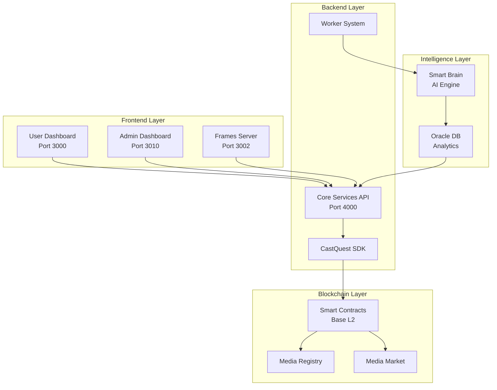
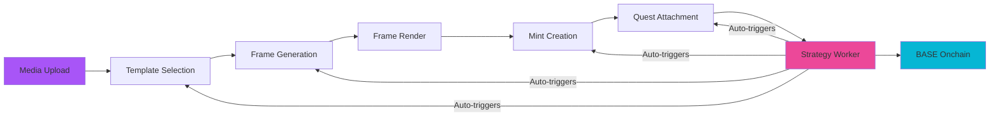
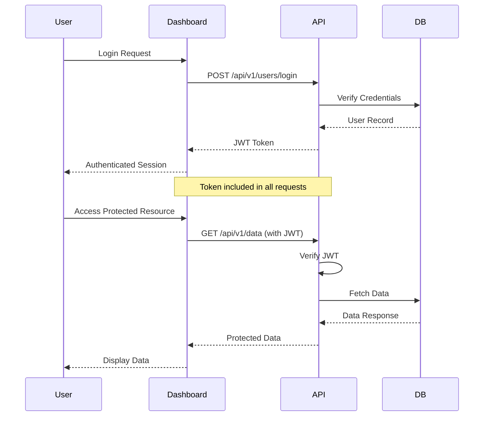
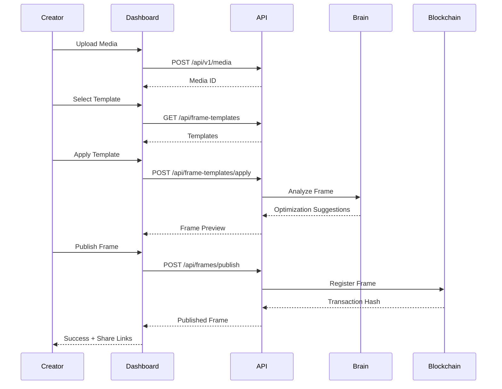
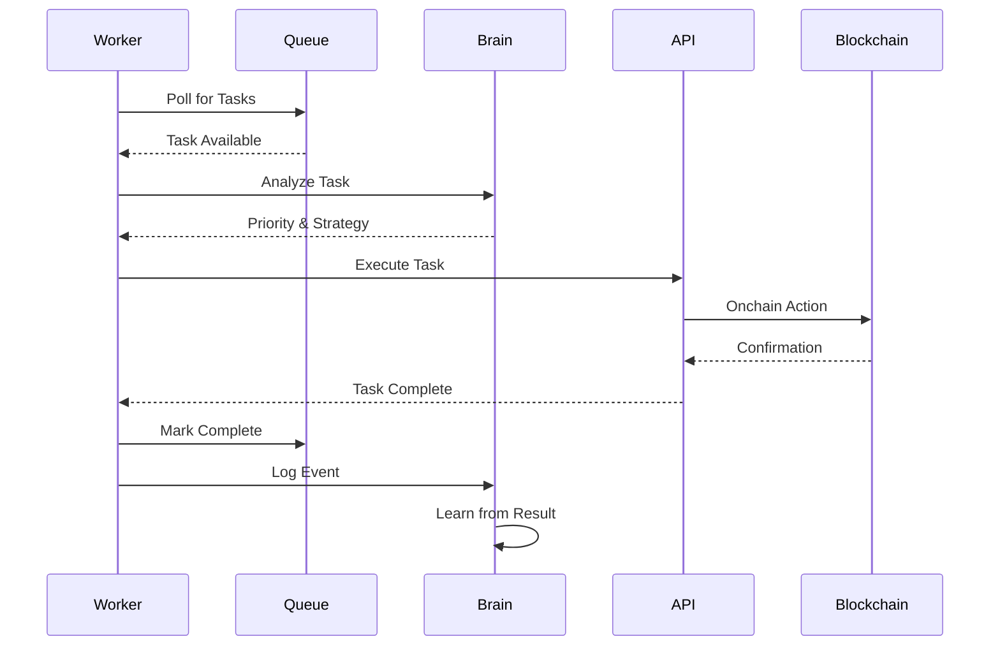

# CastQuest Protocol Architecture

> Complete architectural overview of the CastQuest Frames protocol

---

## Table of Contents

- [High-Level Overview](#high-level-overview)
- [Protocol Flow](#protocol-flow)
- [Module Pipeline](#module-pipeline)
- [System Layers](#system-layers)
- [Component Interaction](#component-interaction)
- [Data Flow](#data-flow)
- [Security Architecture](#security-architecture)
- [Scalability Design](#scalability-design)

---

## High-Level Overview

CastQuest is a modular Web3 social protocol where **Media → Templates → Frames → Mints → Quests → Strategy → Onchain** forms an operator-controlled automation spine.

### Core Principles

1. **Sovereignty First** - Operators control everything
2. **Media-First** - Content drives the protocol
3. **Composability** - Everything is modular and reusable
4. **Transparency** - All flows are visible and auditable
5. **AI-Native** - Smart Brain optimizes and automates

### Architecture Diagram



---

## Protocol Flow

The complete flow from media upload to onchain mint:



### Step-by-Step Flow

1. **Media Upload**
   - Creator uploads photo/video/audio
   - Stored in media registry
   - Metadata extracted and indexed

2. **Template Selection**
   - Browse template marketplace
   - Select or create custom template
   - Configure template parameters

3. **Frame Generation**
   - Apply template to media
   - Generate interactive frame
   - Validate frame schema

4. **Frame Render**
   - Render frame for preview
   - Test interactions
   - Optimize for different platforms

5. **Mint Creation**
   - Define mint parameters
   - Set supply and pricing
   - Configure royalties

6. **Quest Attachment** (Optional)
   - Add gamification layer
   - Set completion criteria
   - Configure rewards

7. **Strategy Worker**
   - Monitors all components
   - Auto-triggers updates
   - Optimizes performance

8. **Onchain Deployment**
   - Deploy to Base L2
   - Register in MediaRegistry
   - Enable trading on market

---

## Module Pipeline

CastQuest is organized into distinct modules (M4-M8):

### Module 4: BASE API + Mobile Admin

**Purpose:** Core backend services and admin interface

**Components:**
- Mock BASE onchain routes
- Mobile-friendly admin layout
- Strategy logs dashboard

**Endpoints:**
```
/api/base/mint
/api/base/frame
/api/base/token-info
/api/base/tx-status
```

**Features:**
- JWT authentication
- Rate limiting
- Audit logging
- Health monitoring

---

### Module 5B: Quest Engine MEGA

**Purpose:** Gamification and quest management

**Data Files:**
- `quests.json` - Quest definitions
- `quest-steps.json` - Step requirements
- `quest-rewards.json` - Reward configurations
- `quest-progress.json` - User progress tracking

**Admin Routes:**
```
/quests                  # List all quests
/quests/create          # Create new quest
/quests/[id]            # Edit quest
```

**Web Routes:**
```
/quests                  # Browse quests
/quests/[id]            # View quest details
```

**API Routes:**
```
POST   /api/quests/create
POST   /api/quests/add-step
POST   /api/quests/add-reward
PUT    /api/quests/progress
POST   /api/quests/complete
POST   /api/quests/trigger
```

---

### Module 6: Frame Template Engine MEGA

**Purpose:** Reusable frame template system

**Data Files:**
- `frame-templates.json` - Template library

**Admin Routes:**
```
/frame-templates         # Browse templates
/frame-templates/create # Create template
/frame-templates/[id]   # Edit template
```

**Web Routes:**
```
/frames/templates        # Public template gallery
/frames/templates/[id]  # Template details
```

**API Routes:**
```
POST   /api/frame-templates/create
PUT    /api/frame-templates/update
DELETE /api/frame-templates/delete
POST   /api/frame-templates/apply
```

**Template Schema:**
```json
{
  "id": "template-uuid",
  "name": "Mint Frame",
  "layout": {
    "primaryText": "{{title}}",
    "secondaryText": "{{description}}",
    "cta": {
      "label": "Mint Now",
      "action": "mint"
    }
  },
  "variables": ["title", "description"],
  "preview": "https://..."
}
```

---

### Module 7: Mint + Render + Automation Worker MEGA

**Purpose:** NFT minting, frame rendering, and automation

**Data Files:**
- `mints.json` - Mint records
- `mint-events.json` - Mint activity
- `frames.json` - Frame definitions
- `worker-events.json` - Worker activity

**Admin Routes:**
```
/mints              # All mints
/mints/[id]        # Mint details
/frames/[id]       # Frame editor
```

**API Routes:**
```
POST   /api/mints/create
POST   /api/mints/simulate
POST   /api/mints/claim
POST   /api/mints/attach-to-frame
POST   /api/mints/attach-to-quest
POST   /api/frames/render
POST   /api/strategy/worker/run
POST   /api/strategy/worker/scan
```

**Worker Features:**
- Parallel task execution (5 workers)
- Smart scheduling via Brain
- Self-healing on errors
- Performance tracking

---

### Module 8: Analytics & Reporting

**Purpose:** Data insights and protocol analytics

**Features:**
- Real-time dashboard metrics
- User engagement analytics
- Revenue tracking
- Performance monitoring

**Oracle DB Integration:**
- Parallel sync every 5 seconds
- Connection pooling (2-10 connections)
- Smart Brain query optimization

---

## System Layers

### Layer 1: Frontend (Presentation)

**Components:**
- User Dashboard (Next.js, React, Neo Glow UI)
- Admin Dashboard (Next.js, React, Advanced Controls)
- Frames Server (Farcaster Integration)

**Technologies:**
- Next.js 14 with App Router
- React 18.2
- TypeScript 5.3
- Tailwind CSS + Neo Glow theme
- Framer Motion for animations

**Responsibilities:**
- User interaction
- Visual rendering
- Form validation
- State management
- Real-time updates

---

### Layer 2: API (Business Logic)

**Components:**
- Core Services REST API
- CastQuest SDK
- Authentication & Authorization

**Technologies:**
- Express.js
- TypeScript
- Drizzle ORM
- JWT authentication
- Rate limiting (100 req/15min)

**Responsibilities:**
- Request handling
- Business logic execution
- Data validation
- Permission checking
- Audit logging

---

### Layer 3: Blockchain (Persistence & Trust)

**Components:**
- Smart Contracts (Solidity)
- MediaRegistry
- MediaTokenFactory
- MediaMarket (AMM)
- FeeRouter

**Technologies:**
- Solidity 0.8.23
- Foundry framework
- Base L2 network
- OpenZeppelin contracts

**Responsibilities:**
- Immutable storage
- Token management
- Market operations
- Fee distribution
- Trustless execution

---

### Layer 4: Intelligence (Automation & Optimization)

**Components:**
- Smart Brain Engine
- Autonomous Worker System
- Oracle Database
- Pattern Recognition

**Technologies:**
- TypeScript AI agents
- PostgreSQL (Oracle)
- Event-driven architecture
- Machine learning models

**Responsibilities:**
- Deep thinking analysis
- Pattern discovery
- Predictive analytics
- Autonomous decisions
- Performance optimization

---

## Component Interaction

### Authentication Flow



---

### Frame Creation Flow



---

### Worker Execution Flow



---

## Data Flow

### Read Operations

1. **User Request** → Dashboard
2. **API Call** → Core Services
3. **Permission Check** → RBAC System
4. **Database Query** → PostgreSQL/Oracle
5. **Response Transform** → DTO
6. **Cache Update** → Redis (if applicable)
7. **Return Data** → Dashboard
8. **Render UI** → User

### Write Operations

1. **User Action** → Dashboard
2. **Validation** → Client-side
3. **API Call** → Core Services
4. **Auth Check** → JWT Validation
5. **Permission Check** → RBAC
6. **Business Logic** → Service Layer
7. **Database Write** → PostgreSQL
8. **Audit Log** → Logging System
9. **Event Emit** → Event Bus
10. **Smart Brain Notify** → AI Analysis
11. **Worker Queue** → Background Tasks
12. **Response** → Dashboard

---

## Security Architecture

### Defense in Depth

**Layer 1: Network Security**
- HTTPS only in production
- CORS configuration
- Rate limiting (100 req/15min)
- DDoS protection

**Layer 2: Application Security**
- JWT authentication (7-day expiry)
- RBAC with 19 permissions
- Input validation (Zod schemas)
- XSS prevention
- CSRF tokens
- SQL injection prevention (ORM)

**Layer 3: Data Security**
- Password hashing (bcrypt, 10 rounds)
- Encrypted env variables
- Secure secret management
- Database encryption at rest
- Audit logging for all sensitive operations

**Layer 4: Smart Contract Security**
- Audited contract code
- Access control modifiers
- Reentrancy guards
- Integer overflow protection
- Emergency pause functionality

---

## Scalability Design

### Horizontal Scaling

**Frontend:**
- Stateless Next.js apps
- Deploy multiple instances
- Load balancer distribution
- CDN for static assets

**Backend:**
- Stateless API servers
- Horizontal pod autoscaling
- Database connection pooling
- Redis for session sharing

**Blockchain:**
- Layer 2 for scalability (Base)
- Batch transactions
- Off-chain computation
- On-chain verification

### Vertical Scaling

**Database:**
- Read replicas for queries
- Write primary for mutations
- Connection pooling (2-10)
- Query optimization
- Index management

**Workers:**
- Parallel execution (5 workers)
- Task queue management
- Priority-based scheduling
- Dynamic worker allocation

### Caching Strategy

**Levels:**
1. **Browser Cache** - Static assets (24h)
2. **CDN Cache** - Public content (1h)
3. **Application Cache** - Redis (5-15min)
4. **Database Cache** - Query results (1-5min)
5. **Smart Contract Cache** - Blockchain reads (15min)

---

## Related Documentation

- **[Modules](./modules.md)** - Detailed module breakdown
- **[Flows](./flows.md)** - End-to-end protocol flows
- **[System Overview](./SYSTEM-OVERVIEW.md)** - Complete system documentation
- **[Smart Brain](./sdk/smart-brain.md)** - AI architecture
- **[API Reference](./API_REFERENCE.md)** - Complete API docs

---

**Last Updated:** 2026-02-07  
**Version:** 2.0.0  
**Status:** Production Ready ✅