# CastQuest Protocol Flows

> End-to-end flows through the CastQuest protocol

---

## Table of Contents

- [Core Flows](#core-flows)
- [User Journeys](#user-journeys)
- [Admin Operations](#admin-operations)
- [Smart Brain Flows](#smart-brain-flows)
- [Worker Automation](#worker-automation)
- [Blockchain Flows](#blockchain-flows)

---

## Core Flows

### 1. Media → Frame Template → Frame

The fundamental content creation flow.

**Steps:**

1. **Upload Media** (web/admin)
   - Navigate to media upload
   - Select file (image/video/audio)
   - Add metadata (title, description, tags)
   - Submit to media registry

2. **Create/Select Frame Template**
   - Browse template marketplace at `/frame-templates`
   - OR create new template at `/frame-templates/create`
   - Configure template variables
   - Preview template layout

3. **Apply Template**
   - Call `/api/frame-templates/apply`
   - Pass media ID and template ID
   - System generates frame entry
   - Returns frame preview URL

4. **Inspect & Refine**
   - View frame at `/frames/[id]`
   - Test interactions
   - Adjust parameters
   - Finalize frame

**Mermaid Diagram:**

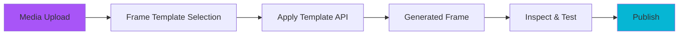

**API Sequence:**

```
POST /api/v1/media
  → mediaId

GET /api/frame-templates
  → templates[]

POST /api/frame-templates/apply
  body: { mediaId, templateId, variables }
  → frameId

GET /api/frames/:frameId
  → frame details
```

---

### 2. Frame → Mint → Onchain

Transform frame into mintable NFT.

**Steps:**

1. **Configure Mint**
   - Select frame at `/frames/[id]`
   - Click "Create Mint"
   - Set supply (limited/unlimited)
   - Configure pricing
   - Set royalty percentage
   - Add mint description

2. **Simulate Mint**
   - Call `/api/mints/simulate`
   - Verify gas costs
   - Check contract parameters
   - Review fee breakdown

3. **Deploy Onchain**
   - Call `/api/mints/create`
   - Sign transaction
   - Wait for confirmation
   - Get contract address

4. **Register in Protocol**
   - Update MediaRegistry
   - Enable market trading
   - Activate social sharing
   - Start analytics tracking

**Mermaid Diagram:**

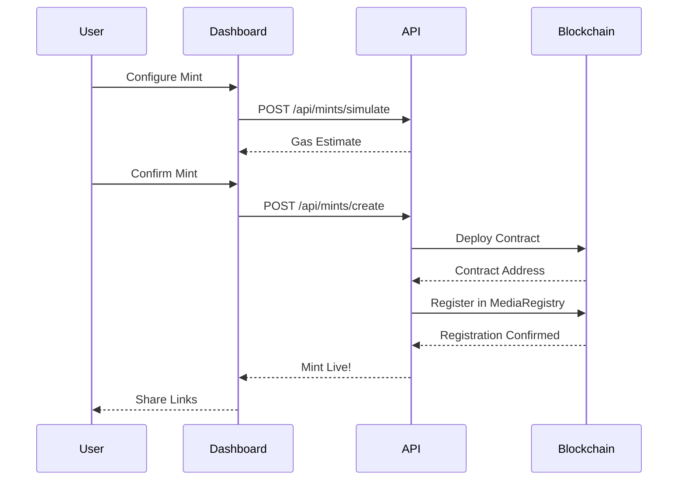

**Data Flow:**

```json
// Step 1: Mint Configuration
{
  "frameId": "frame-123",
  "supply": 100,
  "price": "0.01",
  "royalty": 5,
  "description": "Limited edition photo mint"
}

// Step 2: Simulation Result
{
  "gasEstimate": "0.002 ETH",
  "protocolFee": "0.001 ETH",
  "total": "0.003 ETH"
}

// Step 3: Mint Created
{
  "mintId": "mint-456",
  "contractAddress": "0x...",
  "txHash": "0x...",
  "status": "confirmed"
}
```

---

### 3. Quest Creation & Completion

Gamification layer for user engagement.

**Steps:**

#### Creator Side

1. **Create Quest**
   - Go to `/quests/create`
   - Set quest title and description
   - Define quest type (daily/weekly/milestone)
   - Configure difficulty level

2. **Add Steps**
   - Call `/api/quests/add-step`
   - Define step requirements
   - Set completion criteria
   - Add hints/guidance

3. **Add Rewards**
   - Call `/api/quests/add-reward`
   - Specify reward type (tokens/NFTs/badges)
   - Set reward amounts
   - Configure distribution rules

4. **Publish Quest**
   - Review all settings
   - Set start/end dates
   - Publish to marketplace

#### User Side

1. **Discover Quest**
   - Browse at `/quests`
   - Filter by category/difficulty
   - View quest details at `/quests/[id]`

2. **Accept Quest**
   - Click "Accept Quest"
   - View progress tracker
   - See step requirements

3. **Complete Steps**
   - Perform required actions
   - Call `/api/quests/progress` for each step
   - Track completion percentage

4. **Claim Rewards**
   - All steps completed
   - Call `/api/quests/complete`
   - Receive rewards
   - Share achievement

**Mermaid Diagram:**

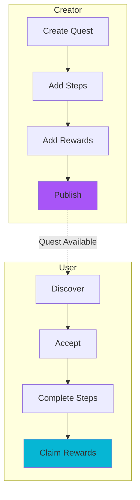

---

### 4. Template Marketplace Flow

Buy, sell, and share frame templates.

**Seller Flow:**

1. **Create Template**
   - Design frame layout
   - Test with sample media
   - Set price and licensing

2. **List on Marketplace**
   - Provide preview images
   - Write description
   - Set categories/tags
   - Publish listing

3. **Receive Payments**
   - Automatic royalty tracking
   - Payment on each use
   - Analytics dashboard

**Buyer Flow:**

1. **Browse Marketplace**
   - Filter by category
   - Search by keywords
   - View top templates

2. **Preview Template**
   - See example frames
   - Check compatibility
   - Read reviews

3. **Purchase & Use**
   - One-time or subscription
   - Download template
   - Apply to own media

---

## User Journeys

### New Creator Onboarding

**Day 1: Setup**

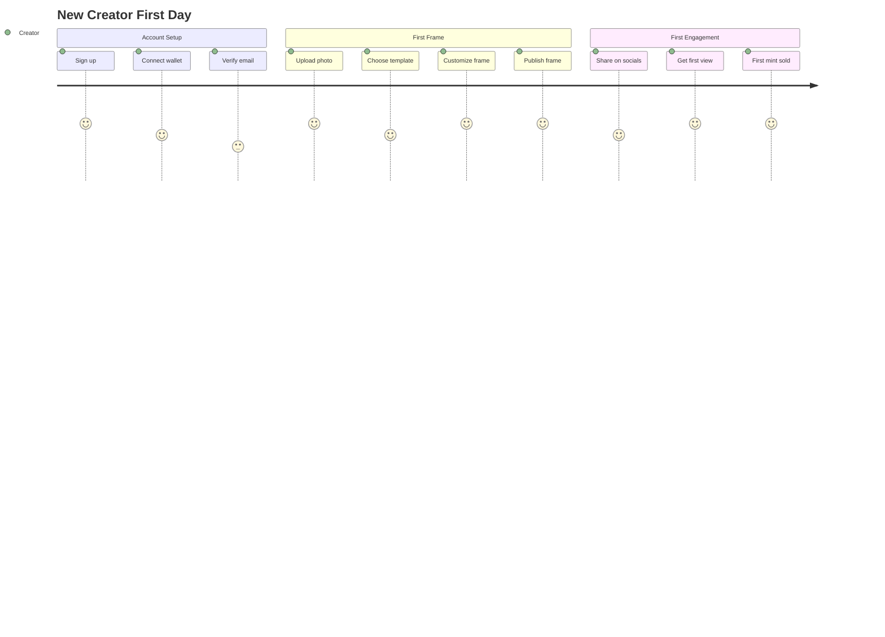

**Week 1: Growth**
1. Create 5 different frames
2. Try AI frame builder
3. Join community challenges
4. List template on marketplace
5. Reach 100 views

**Month 1: Monetization**
1. 50+ frames created
2. First template sale
3. 1000+ total views
4. Complete creator quest
5. Unlock advanced features

---

### Power User Flow

Daily workflow for established creators:

**Morning Routine:**
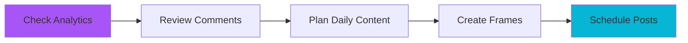

1. **8:00 AM** - Check overnight analytics
2. **8:30 AM** - Respond to community
3. **9:00 AM** - Create 3 new frames
4. **10:00 AM** - Optimize listings
5. **11:00 AM** - Engage with other creators

**Content Pipeline:**
- Monday: Photo frames
- Tuesday: Video frames  
- Wednesday: Audio frames
- Thursday: Quest creation
- Friday: Template design
- Weekend: Community engagement

---

## Admin Operations

### System Health Monitoring

**Real-time Dashboard Flow:**

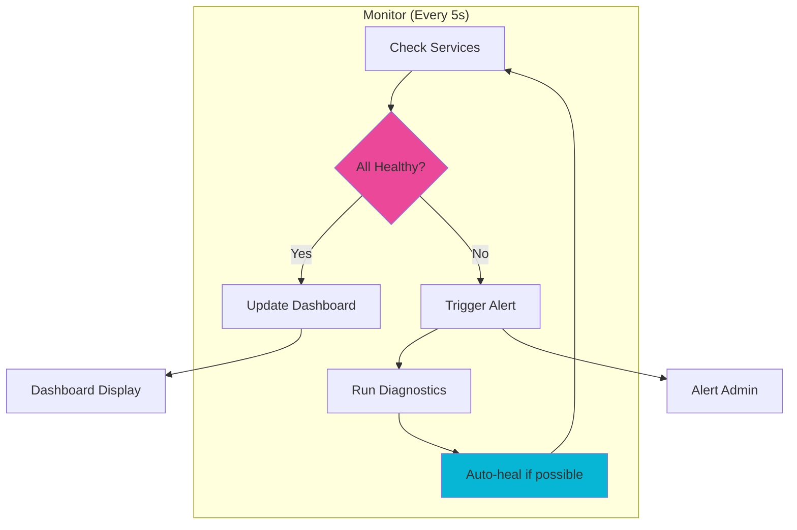

**Alert Escalation:**
1. **Level 1 (Warning)** - Dashboard notification
2. **Level 2 (Error)** - Email alert
3. **Level 3 (Critical)** - SMS + Email + Slack
4. **Level 4 (Emergency)** - All channels + Auto-heal attempt

---

### Risk Management Flow

**Content Moderation:**

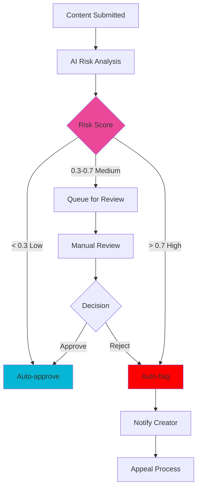

**Risk Categories:**
- **SPAM** - Repetitive/low-quality content
- **NSFW** - Adult content
- **SCAM** - Fraudulent schemes
- **VIOLENCE** - Graphic violence
- **HATE** - Hate speech

---

### Token Management Flow

**Fee Adjustment Process:**

1. **Proposal**
   - Admin proposes fee change
   - Provide rationale
   - Set effective date

2. **Analysis**
   - Smart Brain projects impact
   - Calculate revenue changes
   - Estimate user response

3. **Approval**
   - Multi-sig approval required
   - Record in audit log
   - Schedule deployment

4. **Implementation**
   - Update smart contracts
   - Notify users (7 days advance)
   - Deploy changes
   - Monitor effects

---

## Smart Brain Flows

### Deep Thinking Analysis

**Trigger → Process → Result:**

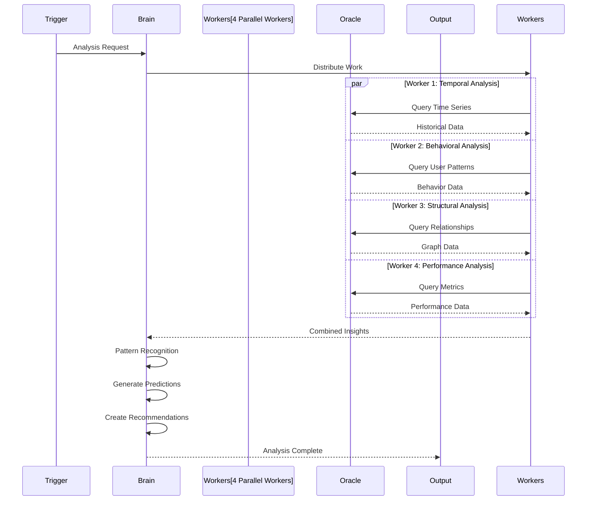

**Output Format:**

```json
{
  "thoughtId": "thought_1234567890",
  "confidence": 0.91,
  "patterns": [
    {
      "type": "temporal",
      "description": "Peak usage 6-8 PM",
      "confidence": 0.95
    },
    {
      "type": "behavioral",
      "description": "Users prefer photo over video",
      "confidence": 0.88
    }
  ],
  "predictions": [
    {
      "metric": "daily_active_users",
      "prediction": 5000,
      "confidence": 0.87
    }
  ],
  "recommendations": [
    {
      "action": "increase_worker_capacity",
      "reason": "Anticipated 20% traffic surge",
      "priority": "high"
    }
  ]
}
```

---

### Learning Loop

**Continuous Improvement:**

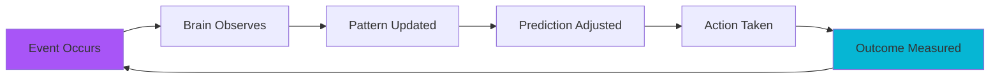

**Learning Sources:**
- User interactions
- System performance
- Transaction outcomes
- Community feedback
- Market conditions

---

## Worker Automation

### Task Queue Management

**Priority-Based Execution:**

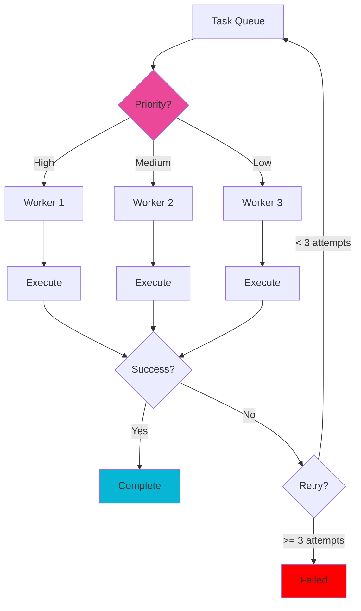

**Task Types:**
1. **High Priority** - User-facing operations
2. **Medium Priority** - Data processing
3. **Low Priority** - Analytics and cleanup

---

### Autonomous Optimization

**Self-Tuning System:**

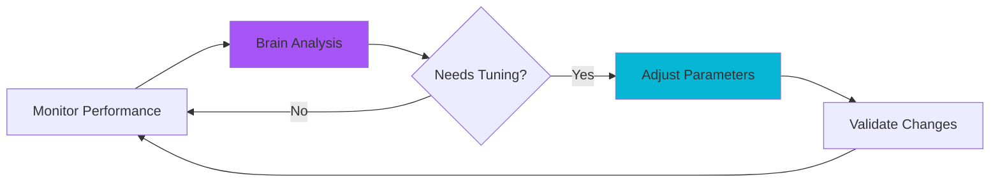

**Tunable Parameters:**
- Worker pool size
- Task timeout limits
- Retry strategies
- Cache durations
- Query batch sizes

---

## Blockchain Flows

### Contract Deployment

**Deployment Pipeline:**

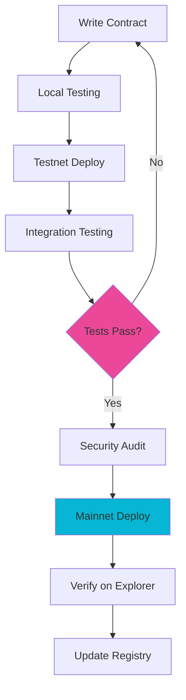

---

### Transaction Flow

**User Transaction:**

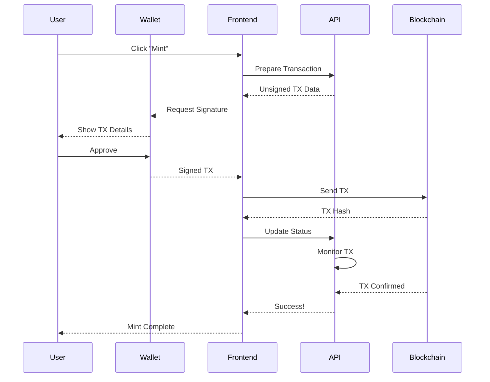

---

## Related Documentation

- **[Architecture](./architecture.md)** - System architecture
- **[Modules](./modules.md)** - Module details
- **[API Reference](./API_REFERENCE.md)** - API endpoints
- **[Smart Brain](./sdk/smart-brain.md)** - AI system

---

**Last Updated:** 2026-02-07  
**Version:** 2.0.0  
**Status:** Complete ✅