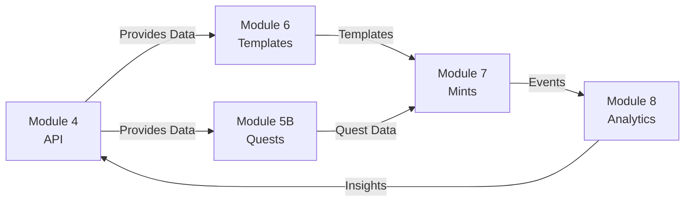

# CastQuest Modules Documentation

> Comprehensive breakdown of all protocol modules (M4-M8)

---

## Table of Contents

- [Overview](#overview)
- [Module 4: BASE API + Mobile Admin + Strategy Dashboard](#module-4-base-api--mobile-admin--strategy-dashboard)
- [Module 5B: Quest Engine MEGA](#module-5b-quest-engine-mega)
- [Module 6: Frame Template Engine MEGA](#module-6-frame-template-engine-mega)
- [Module 7: Mint + Render + Automation Worker MEGA](#module-7-mint--render--automation-worker-mega)
- [Module 8: Analytics & Reporting](#module-8-analytics--reporting)
- [Module Integration](#module-integration)

---

## Overview

CastQuest is organized into modular components, each handling specific aspects of the protocol. This modular architecture ensures:

- **Separation of Concerns** - Each module has a clear responsibility
- **Independent Development** - Modules can be developed and tested separately
- **Easy Maintenance** - Issues are isolated to specific modules
- **Scalability** - Modules can scale independently based on demand

### Module Map

```mermaid
flowchart TB
    subgraph M4["Module 4: BASE API"]
        M4A[Core Services]
        M4B[Admin Interface]
        M4C[Strategy Dashboard]
    end
    
    subgraph M5B["Module 5B: Quest Engine"]
        M5A[Quest Definition]
        M5B[Progress Tracking]
        M5C[Reward Distribution]
    end
    
    subgraph M6["Module 6: Frame Templates"]
        M6A[Template Library]
        M6B[Template Editor]
        M6C[Marketplace]
    end
    
    subgraph M7["Module 7: Mints & Workers"]
        M7A[Mint Creation]
        M7B[Frame Rendering]
        M7C[Worker System]
    end
    
    subgraph M8["Module 8: Analytics"]
        M8A[Data Collection]
        M8B[Reporting]
        M8C[Insights]
    end
    
    M4 --> M5B
    M4 --> M6
    M4 --> M7
    M4 --> M8
    M6 --> M7
    M5B --> M7
    M7 --> M8
```

---

## Module 4: BASE API + Mobile Admin + Strategy Dashboard

### Purpose
Core backend services providing REST API, admin interface, and strategy monitoring.

### Location
- **API:** `packages/core-services/`
- **Admin:** `apps/admin/`

### Components

#### 1. BASE API (Mock Routes)

**Mock Onchain Routes:**

```typescript
// Mock BASE blockchain interactions
GET  /api/base/mint              // Mint status check
POST /api/base/frame             // Frame registration
GET  /api/base/token-info        // Token information
GET  /api/base/tx-status         // Transaction status
```

**Implementation:**
```typescript
// packages/core-services/src/routes/base.ts
export const baseRoutes = express.Router();

baseRoutes.post('/mint', async (req, res) => {
  const { tokenAddress, amount, recipient } = req.body;
  
  // Mock mint operation
  const mintResult = {
    success: true,
    txHash: '0x' + Math.random().toString(16).substr(2, 64),
    timestamp: Date.now()
  };
  
  res.json(mintResult);
});
```

#### 2. Mobile-Friendly Admin Layout

**ShellLayout Component:**

```typescript
// apps/admin/components/ShellLayout.tsx
export function ShellLayout({ children }) {
  return (
    <div className="min-h-screen bg-slate-900">
      <MobileNav />
      <Sidebar />
      <main className="lg:ml-64 p-4">
        {children}
      </main>
    </div>
  );
}
```

**Features:**
- Responsive navigation
- Collapsible sidebar
- Touch-friendly controls
- Mobile-optimized tables
- Gesture support

#### 3. Strategy Dashboard

**Location:** `/strategy`

**Displays:**
- Worker execution logs
- Strategy performance metrics
- Automation status
- Event timeline
- Error reports

**API Endpoints:**
```typescript
GET /api/strategy/logs           // Execution logs
GET /api/strategy/metrics        // Performance metrics
GET /api/strategy/status         // Current status
POST /api/strategy/trigger       // Manual trigger
```

### Data Storage

**Files:**
- `data/strategy-logs.json` - Execution history
- `data/worker-events.json` - Worker activity
- `data/automation-metrics.json` - Performance data

**Schema:**
```json
{
  "strategyLogs": [
    {
      "id": "log_1234",
      "timestamp": "2026-02-07T10:00:00Z",
      "strategy": "auto-mint-optimizer",
      "action": "price_adjustment",
      "result": "success",
      "details": {
        "old_price": "0.01",
        "new_price": "0.012",
        "reason": "market_demand"
      }
    }
  ]
}
```

---

## Module 5B: Quest Engine MEGA

### Purpose
Comprehensive gamification system for user engagement and retention.

### Location
`packages/quests/`

### Components

#### 1. Quest Management System

**Quest Types:**
- **Daily Quests** - Reset every 24 hours
- **Weekly Quests** - Reset every 7 days
- **Milestone Quests** - One-time achievements
- **Community Quests** - Collaborative goals
- **Seasonal Quests** - Limited time events

**Quest Schema:**
```json
{
  "id": "quest_daily_creator",
  "title": "Daily Creator Challenge",
  "description": "Create and publish 3 frames today",
  "type": "daily",
  "difficulty": "medium",
  "points": 100,
  "xp": 50,
  "status": "active",
  "startDate": "2026-02-07T00:00:00Z",
  "endDate": "2026-02-07T23:59:59Z",
  "steps": [
    {
      "id": "step_1",
      "title": "Create first frame",
      "requirement": "create_frame",
      "target": 1,
      "completed": false
    },
    {
      "id": "step_2",
      "title": "Create second frame",
      "requirement": "create_frame",
      "target": 2,
      "completed": false
    },
    {
      "id": "step_3",
      "title": "Create third frame",
      "requirement": "create_frame",
      "target": 3,
      "completed": false
    }
  ],
  "rewards": [
    {
      "type": "tokens",
      "amount": 10,
      "token": "CAST"
    },
    {
      "type": "badge",
      "name": "Daily Creator",
      "image": "/badges/daily-creator.png"
    }
  ]
}
```

#### 2. Progress Tracking

**User Progress Schema:**
```json
{
  "userId": "user_123",
  "questId": "quest_daily_creator",
  "progress": {
    "step_1": { "completed": true, "completedAt": "2026-02-07T10:00:00Z" },
    "step_2": { "completed": true, "completedAt": "2026-02-07T11:00:00Z" },
    "step_3": { "completed": false, "progress": 0 }
  },
  "overallProgress": 66.67,
  "startedAt": "2026-02-07T09:00:00Z",
  "completedAt": null,
  "claimedAt": null
}
```

#### 3. Reward System

**Reward Types:**
- **Tokens** - CAST or other protocol tokens
- **NFTs** - Special badges or collectibles
- **XP** - Experience points for leveling
- **Badges** - Achievement badges
- **Access** - Unlock premium features
- **Multipliers** - Boost earnings temporarily

### Admin Routes

```
/quests                  # List all quests
/quests/create          # Create new quest
/quests/[id]            # Edit quest
/quests/analytics       # Quest performance
/quests/leaderboard     # Top performers
```

### Web Routes

```
/quests                  # Browse available quests
/quests/[id]            # Quest details and progress
/quests/my-quests       # User's active quests
/quests/completed       # Completed quests
```

### API Endpoints

```typescript
// Quest Management
POST   /api/quests/create           // Create quest
PUT    /api/quests/:id/update       // Update quest
DELETE /api/quests/:id              // Delete quest
GET    /api/quests                  // List quests
GET    /api/quests/:id              // Get quest details

// Steps Management
POST   /api/quests/:id/add-step     // Add step to quest
PUT    /api/quests/:id/steps/:stepId // Update step
DELETE /api/quests/:id/steps/:stepId // Remove step

// Rewards Management
POST   /api/quests/:id/add-reward   // Add reward
PUT    /api/quests/:id/rewards/:rewardId // Update reward
DELETE /api/quests/:id/rewards/:rewardId // Remove reward

// Progress Tracking
POST   /api/quests/:id/accept       // User accepts quest
PUT    /api/quests/:id/progress     // Update progress
POST   /api/quests/:id/complete     // Mark quest complete
POST   /api/quests/:id/claim        // Claim rewards

// Automation
POST   /api/quests/trigger          // Trigger quest check
POST   /api/quests/auto-complete    // Auto-complete eligible quests
```

### Data Files

```
data/
├── quests.json              # Quest definitions
├── quest-steps.json         # Step configurations
├── quest-rewards.json       # Reward definitions
├── quest-progress.json      # User progress data
└── quest-analytics.json     # Performance metrics
```

---

## Module 6: Frame Template Engine MEGA

### Purpose
Reusable frame template system with marketplace functionality.

### Location
`packages/frames/`

### Components

#### 1. Template Library

**Template Categories:**
- **Mints** - NFT minting templates
- **Galleries** - Photo/video galleries
- **Quests** - Quest interaction templates
- **Games** - Interactive game templates
- **Social** - Social engagement templates
- **Commerce** - E-commerce templates

**Template Schema:**
```json
{
  "id": "template_mint_basic",
  "name": "Basic Mint Template",
  "description": "Simple NFT minting frame with image and CTA",
  "category": "mints",
  "author": "castquest",
  "version": "1.0.0",
  "price": "0.01",
  "license": "commercial",
  "preview": "https://...",
  "layout": {
    "type": "single-column",
    "components": [
      {
        "type": "image",
        "source": "{{media_url}}",
        "aspectRatio": "1:1"
      },
      {
        "type": "text",
        "content": "{{title}}",
        "style": "heading"
      },
      {
        "type": "text",
        "content": "{{description}}",
        "style": "body"
      },
      {
        "type": "button",
        "label": "Mint Now",
        "action": "mint",
        "style": "primary"
      }
    ]
  },
  "variables": [
    {
      "name": "media_url",
      "type": "string",
      "required": true,
      "description": "URL of the media to display"
    },
    {
      "name": "title",
      "type": "string",
      "required": true,
      "maxLength": 50
    },
    {
      "name": "description",
      "type": "string",
      "required": false,
      "maxLength": 200
    }
  ],
  "stats": {
    "downloads": 1234,
    "rating": 4.8,
    "reviews": 56
  }
}
```

#### 2. Template Editor

**Visual Editor Features:**
- Drag-and-drop interface
- Live preview
- Component library
- Style customization
- Variable binding
- Export/Import JSON

**Code Editor Features:**
- Syntax highlighting
- Auto-completion
- Schema validation
- Error detection
- Version control

#### 3. Marketplace

**Seller Features:**
- List templates for sale
- Set pricing (one-time or subscription)
- Track sales and earnings
- Analytics dashboard
- Review management

**Buyer Features:**
- Browse by category
- Search and filter
- Preview before purchase
- Purchase history
- Download management

### Admin Routes

```
/frame-templates              # Browse all templates
/frame-templates/create      # Create new template
/frame-templates/[id]        # Edit template
/frame-templates/analytics   # Template performance
/frame-templates/marketplace # Marketplace management
```

### Web Routes

```
/frames/templates             # Public template gallery
/frames/templates/[id]       # Template details
/frames/templates/my-templates # User's templates
/frames/templates/purchased   # Purchased templates
```

### API Endpoints

```typescript
// Template Management
POST   /api/frame-templates/create      // Create template
PUT    /api/frame-templates/:id/update  // Update template
DELETE /api/frame-templates/:id         // Delete template
GET    /api/frame-templates             // List templates
GET    /api/frame-templates/:id         // Get template

// Template Operations
POST   /api/frame-templates/:id/apply   // Apply to media
POST   /api/frame-templates/:id/clone   // Clone template
POST   /api/frame-templates/:id/publish // Publish to marketplace

// Marketplace
GET    /api/frame-templates/marketplace // Browse marketplace
POST   /api/frame-templates/:id/purchase // Purchase template
GET    /api/frame-templates/my-purchases // User's purchases
```

### Data Files

```
data/
├── frame-templates.json      # Template definitions
├── template-purchases.json   # Purchase records
└── template-analytics.json   # Usage analytics
```

---

## Module 7: Mint + Render + Automation Worker MEGA

### Purpose
NFT minting, frame rendering, and autonomous background task processing.

### Location
`packages/mints/` and `packages/workers/`

### Components

#### 1. Mint System

**Mint Types:**
- **Single Edition** - One-of-one NFTs
- **Limited Edition** - Fixed supply
- **Open Edition** - Unlimited supply with time limit
- **Generative** - Programmatically generated

**Mint Configuration:**
```json
{
  "mintId": "mint_123",
  "frameId": "frame_456",
  "type": "limited",
  "supply": {
    "total": 100,
    "minted": 23,
    "remaining": 77
  },
  "pricing": {
    "price": "0.01",
    "currency": "ETH",
    "dynamic": false
  },
  "royalty": {
    "percentage": 5,
    "recipient": "0x..."
  },
  "contract": {
    "address": "0x...",
    "chain": "base",
    "standard": "ERC-721"
  },
  "metadata": {
    "name": "CastQuest Frame #{{token_id}}",
    "description": "Limited edition frame",
    "image": "ipfs://...",
    "attributes": [...]
  }
}
```

#### 2. Frame Rendering

**Renderer Features:**
- Server-side rendering
- Dynamic content generation
- Multiple output formats (PNG, SVG, HTML)
- Optimization for different platforms
- Cache management

**Rendering API:**
```typescript
POST /api/frames/render
{
  "frameId": "frame_123",
  "format": "png",
  "size": "1200x630",
  "variables": {
    "title": "My Frame",
    "price": "0.01"
  }
}

Response:
{
  "renderUrl": "https://cdn.castquest.io/renders/...",
  "expiresAt": "2026-02-08T10:00:00Z"
}
```

#### 3. Autonomous Worker System

**Worker Types:**
- **Frame Processor** - Processes frame operations
- **Mint Distributor** - Handles mint claims
- **Quest Validator** - Validates quest completion
- **Data Sync** - Synchronizes with blockchain
- **Analytics Collector** - Gathers metrics

**Worker Configuration:**
```typescript
{
  "workerId": "worker_frame_processor_1",
  "type": "frame_processor",
  "status": "active",
  "config": {
    "parallelTasks": 5,
    "priority": "high",
    "retryStrategy": "exponential",
    "maxRetries": 3
  },
  "performance": {
    "tasksCompleted": 1234,
    "tasksFailed": 5,
    "avgProcessingTime": 1250,
    "uptime": "99.9%"
  }
}
```

### Admin Routes

```
/mints              # All mints
/mints/[id]        # Mint details
/frames/[id]       # Frame editor
/workers           # Worker management
/workers/[id]      # Worker details
```

### API Endpoints

```typescript
// Mint Management
POST   /api/mints/create              // Create mint
GET    /api/mints/:id                 // Get mint details
PUT    /api/mints/:id/update          // Update mint
POST   /api/mints/:id/simulate        // Simulate mint
POST   /api/mints/:id/claim           // Claim mint

// Frame Operations
POST   /api/frames/render             // Render frame
GET    /api/frames/:id                // Get frame
POST   /api/mints/:id/attach-to-frame // Attach mint to frame
POST   /api/mints/:id/attach-to-quest // Attach mint to quest

// Worker Management
GET    /api/strategy/worker/status    // Worker status
POST   /api/strategy/worker/run       // Trigger worker
POST   /api/strategy/worker/scan      // Scan for tasks
PUT    /api/strategy/worker/config    // Update config
```

### Data Files

```
data/
├── mints.json           # Mint definitions
├── mint-events.json     # Mint activity
├── frames.json          # Frame definitions
├── worker-events.json   # Worker activity
└── automation-logs.json # Automation logs
```

---

## Module 8: Analytics & Reporting

### Purpose
Comprehensive analytics and reporting system for protocol insights.

### Location
`packages/analytics/`

### Components

#### 1. Data Collection

**Metrics Tracked:**
- User engagement (views, interactions, time spent)
- Transaction metrics (volume, fees, success rate)
- System performance (response times, error rates)
- Content metrics (frames created, mints claimed)
- Financial metrics (revenue, fees collected)

#### 2. Reporting Engine

**Report Types:**
- **Daily Reports** - Daily summaries
- **Weekly Reports** - Week-over-week trends
- **Monthly Reports** - Monthly analytics
- **Custom Reports** - User-defined metrics

#### 3. Insights Dashboard

**Visualizations:**
- Time series charts
- Pie charts
- Heat maps
- Funnel analysis
- Cohort analysis

### API Endpoints

```typescript
GET /api/analytics/overview        // Overview metrics
GET /api/analytics/users          // User metrics
GET /api/analytics/content        // Content metrics
GET /api/analytics/financial      // Financial metrics
GET /api/analytics/performance    // System performance
POST /api/analytics/custom        // Custom report
```

---

## Module Integration

### Inter-Module Communication



### Data Flow

1. **Module 4** provides core API and data access
2. **Module 5B** uses API to manage quests
3. **Module 6** stores templates in shared storage
4. **Module 7** combines templates with mints
5. **Module 8** collects data from all modules

---

## Related Documentation

- **[Architecture](./architecture.md)** - System architecture
- **[Flows](./flows.md)** - Protocol flows
- **[System Overview](./SYSTEM-OVERVIEW.md)** - Complete system
- **[API Reference](./API_REFERENCE.md)** - API docs

---

**Last Updated:** 2026-02-07  
**Version:** 2.0.0  
**Status:** Complete ✅